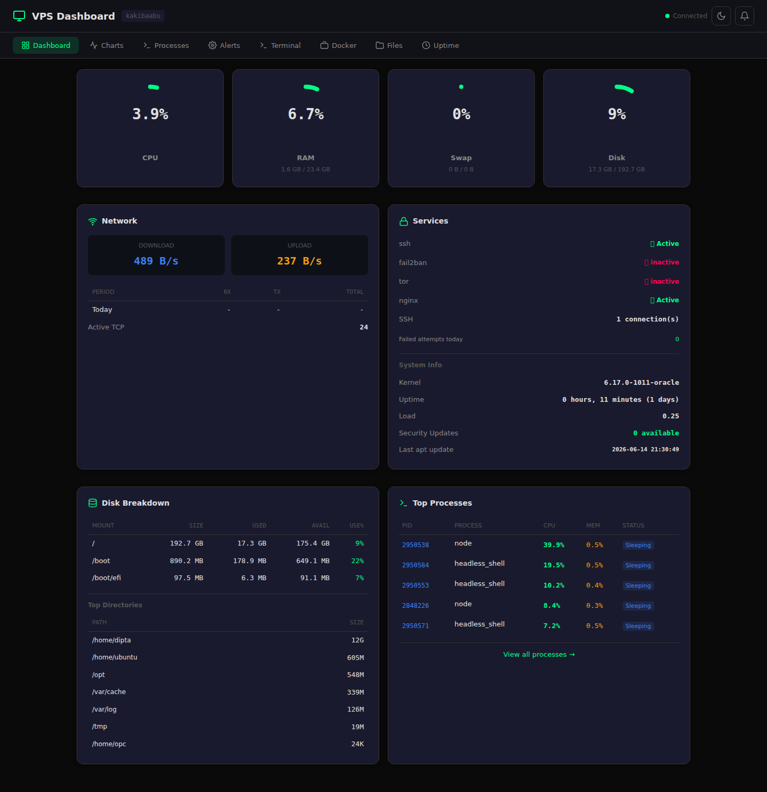
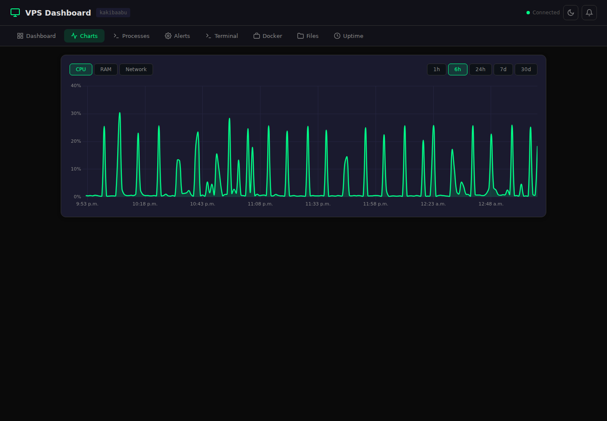
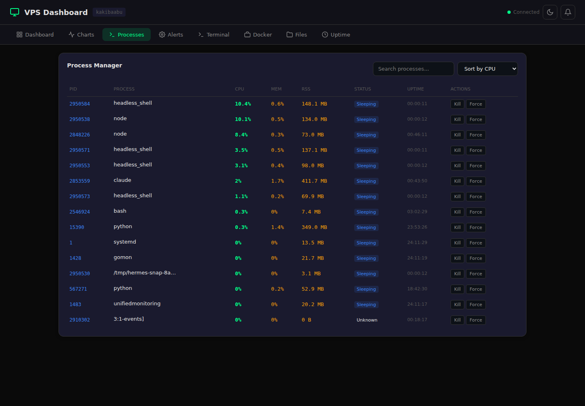
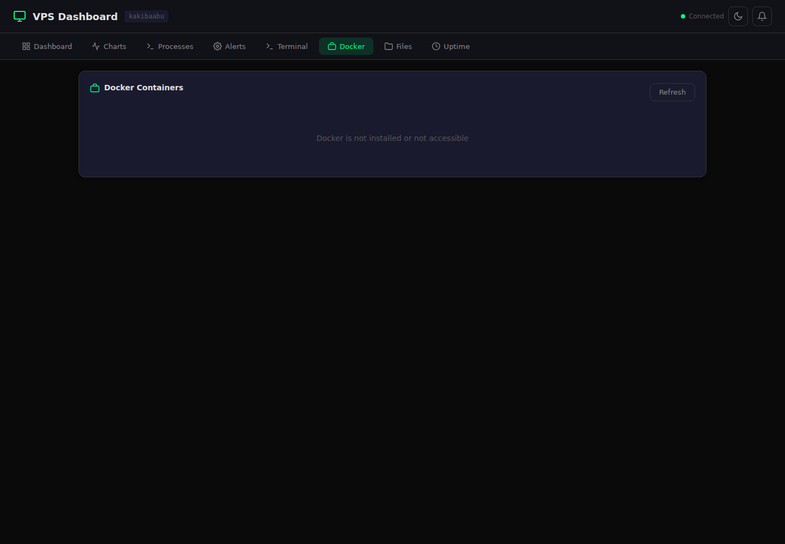
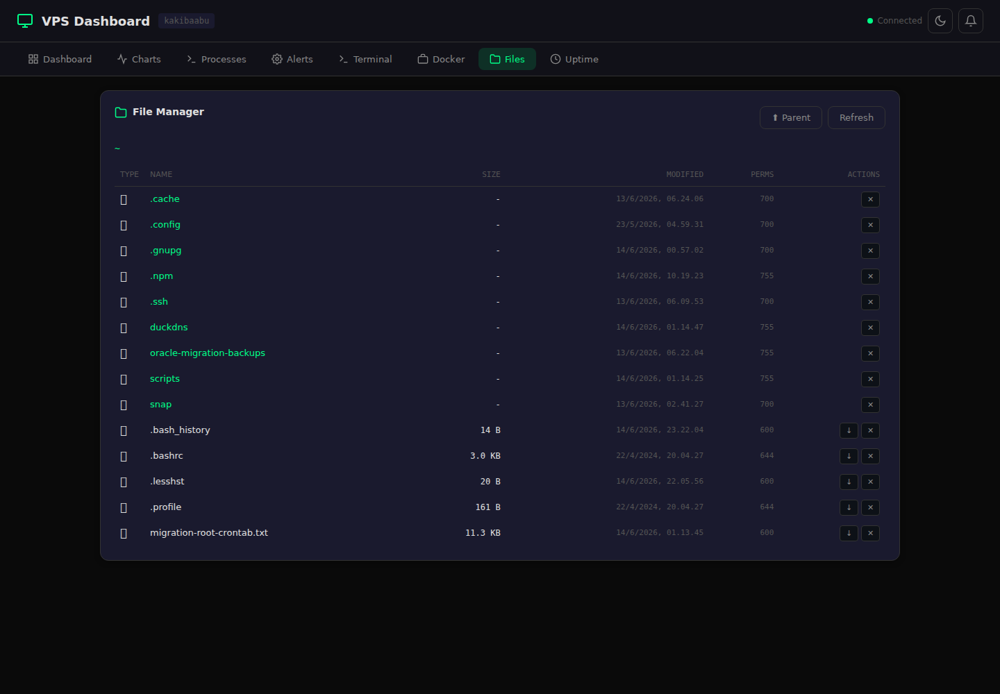
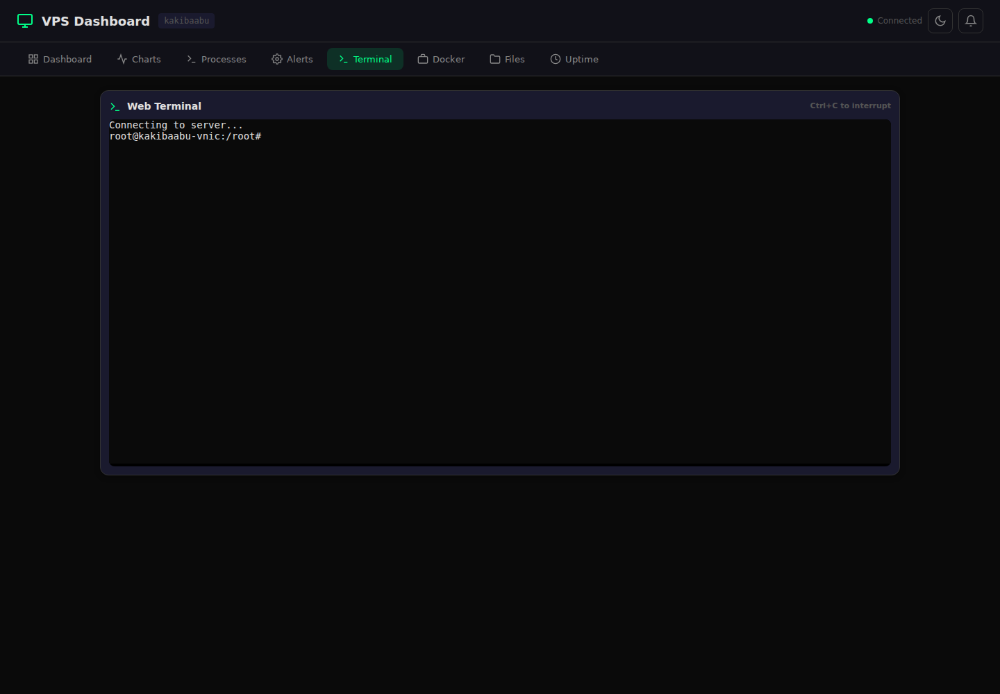
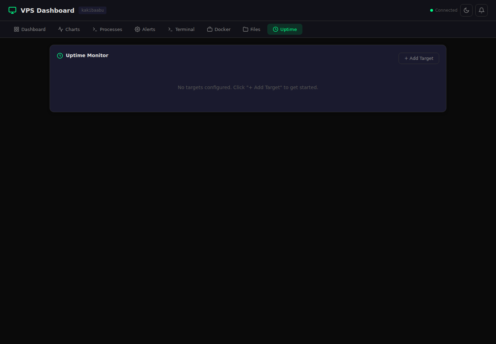
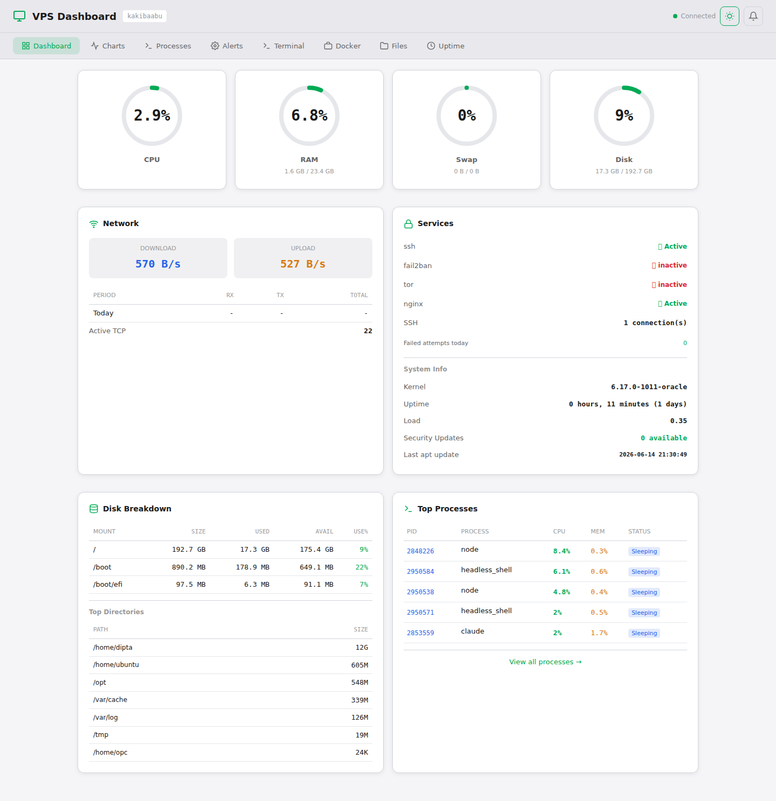

# VPS Dashboard - kakibaabu

Modern, real-time VPS monitoring dashboard with WebSocket updates, process management, Docker monitoring, file manager, uptime monitoring, and Telegram alerts.

## Features

- 📊 **Real-time Monitoring** — CPU, RAM, Swap, Disk, Network via Socket.IO (2s refresh)
- 📈 **Historical Charts** — 1h/6h/24h/7d/30d trends stored in SQLite
- ⚡ **Process Manager** — View, search, sort, kill processes
- 🐳 **Docker Monitor** — Container list, stats, logs, start/stop/restart
- 📁 **File Manager** — Browse, upload, download, edit, delete files
- 🖥️ **Web Terminal** — Live terminal access from browser (xterm.js)
- ⏱️ **Uptime Monitor** — HTTP endpoint checker with history
- 🔔 **Telegram Alerts** — CPU/RAM/Disk/Swap threshold notifications
- 🌙/☀️ **Dark/Light Theme** — Toggle with localStorage persistence
- 📱 **Mobile Responsive** — Works on phone/tablet
- 🔒 **Basic Auth** — Password-protected destructive actions

## Screenshots

### Dashboard


### Charts — CPU, 6h range


### Processes


### Docker


### Files


### Terminal


### Uptime


### Light theme


## Quick Start

```bash
# Clone or copy files
cd vps-dashboard

# Install dependencies
npm install

# Start
node server.js
```

Dashboard available at `http://localhost:3000`

## Deploy to VPS

```bash
# One-command deploy
chmod +x deploy.sh
./deploy.sh
```

The script will:
1. Install Node.js (if missing)
2. Install nginx (if missing)
3. Copy files to `/opt/vps-dashboard`
4. Install npm dependencies
5. Generate random password
6. Create systemd service
7. Configure nginx reverse proxy
8. Setup SSL (if cert exists)

## Configuration

Edit `/etc/systemd/system/vps-dashboard.service`:

| Variable | Default | Description |
|---|---|---|
| `PORT` | 3000 | Server port |
| `HOST` | 127.0.0.1 | Bind address |
| `DASHBOARD_USER` | admin | Login username |
| `DASHBOARD_PASS` | (generated) | Login password |
| `DB_PATH` | /var/lib/vps-dashboard/dashboard.db | SQLite database path |
| `TELEGRAM_TOKEN` | (empty) | Telegram Bot API token |
| `TELEGRAM_CHAT_ID` | (empty) | Telegram chat ID for alerts |
| `NET_IFACE` | enp0s6 | Network interface to monitor |

## Telegram Alerts Setup

1. Message [@BotFather](https://t.me/botfather) → `/newbot`
2. Copy the bot token
3. Message your bot, then visit `https://api.telegram.org/bot<TOKEN>/getUpdates` to find your chat ID
4. Edit the systemd service:
   ```
   Environment=TELEGRAM_TOKEN=your-token
   Environment=TELEGRAM_CHAT_ID=your-chat-id
   ```
5. `sudo systemctl daemon-reload && sudo systemctl restart vps-dashboard`

## API Endpoints

| Method | Path | Auth | Description |
|---|---|---|---|
| GET | `/api/history?range=1h` | No | Historical metrics |
| GET | `/api/processes` | Yes | Top processes |
| POST | `/api/processes/:pid/kill` | Yes | Kill process (SIGTERM) |
| POST | `/api/processes/:pid/kill-force` | Yes | Force kill (SIGKILL) |
| POST | `/api/services/:name/restart` | Yes | Restart service |
| GET | `/api/docker/containers` | Yes | Docker containers |
| GET | `/api/docker/stats` | Yes | Docker stats |
| GET | `/api/docker/logs/:name` | Yes | Container logs |
| POST | `/api/docker/:name/:action` | Yes | Docker action |
| GET | `/api/files?path=` | Yes | List directory |
| GET | `/api/files/read?path=` | Yes | Read file |
| POST | `/api/files/write` | Yes | Write file |
| POST | `/api/files/delete` | Yes | Delete file |
| POST | `/api/files/upload` | Yes | Upload files |
| GET | `/api/uptime/targets` | Yes | Uptime targets |
| POST | `/api/uptime/targets` | Yes | Add target |
| GET | `/api/uptime/checks/:id` | Yes | Uptime history |
| GET | `/api/alerts/config` | Yes | Alert config |
| PUT | `/api/alerts/config/:type` | Yes | Update alert |
| GET | `/api/alerts` | Yes | Alert history |

## Tech Stack

- **Backend:** Node.js + Express + Socket.IO
- **Database:** SQLite (better-sqlite3)
- **Frontend:** Vanilla JS + Chart.js + xterm.js
- **Terminal:** node-pty + xterm.js
- **Monitoring:** /proc filesystem + systemctl + docker CLI
- **Deployment:** systemd + nginx + Let's Encrypt

## License

MIT
