# VPS Dashboard - kakibaabu

Modern, real-time VPS monitoring dashboard with WebSocket updates, process management, Docker monitoring, file manager, uptime monitoring, and Telegram alerts.

## Features

- 📊 **Real-time Monitoring** — CPU, RAM, Swap, Disk, Network via Socket.IO (2s refresh)
- 📈 **Historical Charts** — 1h/6h/24h/7d/30d trends stored in SQLite
- ⚡ **Process Manager** — View, search, sort, kill processes
- 🐳 **Docker Monitor** — Container list, stats, logs, start/stop/restart
- 📁 **File Manager** — Browse, upload, download, edit, delete files
- 🖥️ **Web Terminal** — Live terminal access from browser (xterm.js)
- ⏱️ **Uptime Monitor** — HTTP endpoint checker with history
- 🛠️ **Tools Suite** — Ping, traceroute, DNS lookup, port scan, SSL monitor, cron viewer, backups
- 🛡️ **Security Center** — Health score, fail2ban, login history, audit log, 2FA, notifications
- 📜 **Logs Viewer** — System, auth, nginx, kernel, dashboard, cron, and Docker logs
- 📤 **CSV Export** — Download historical metrics for analysis
- 🔔 **Telegram Alerts** — CPU/RAM/Disk/Swap threshold notifications
- 🌙/☀️ **Dark/Light Theme** — Toggle with localStorage persistence
- 📱 **Mobile Responsive** — Works on phone/tablet
- 🔒 **Basic Auth** — The whole dashboard (pages, REST API, and the real-time socket) sits behind Basic Auth; `/healthz` is the only public route (liveness probe, no data)

## Screenshots

### Dashboard
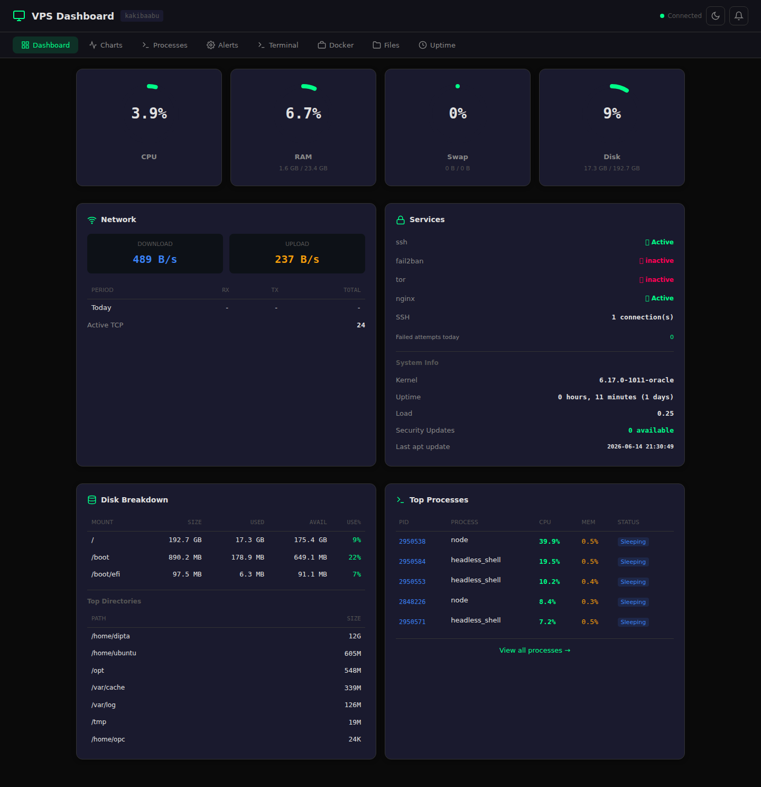

### Charts — CPU, 6h range
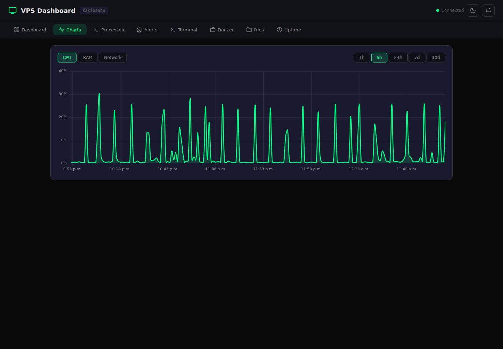

### Processes
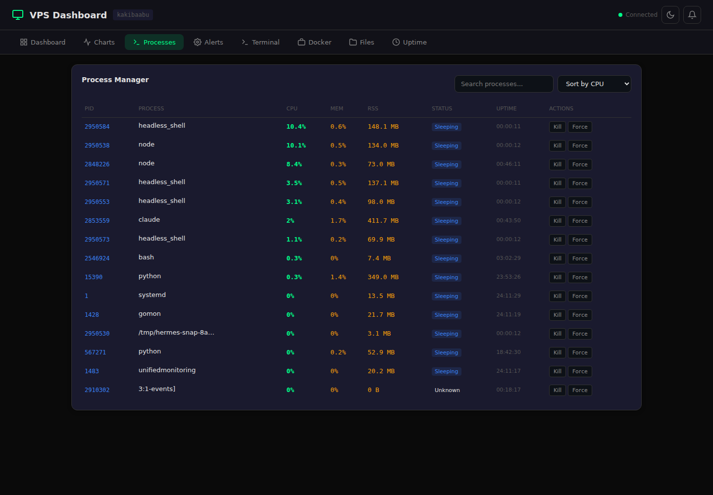

### Docker
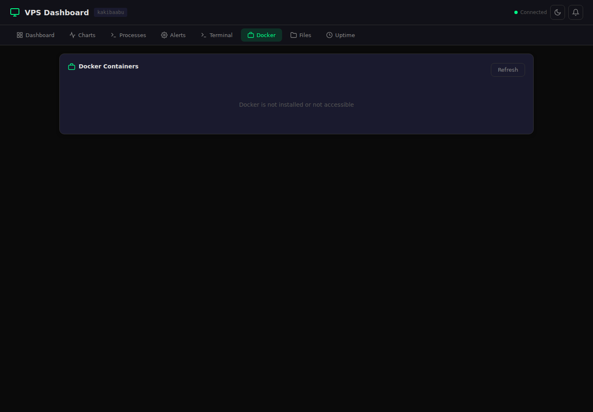

### Files
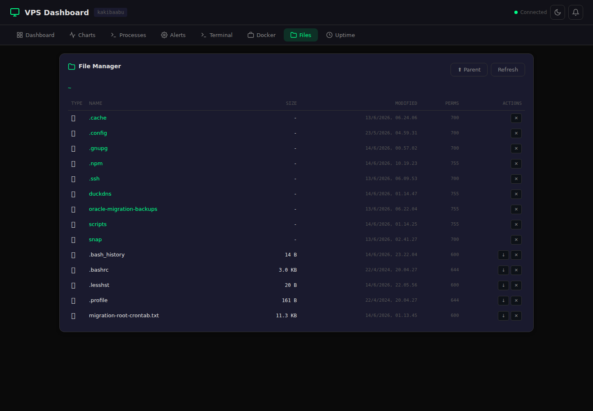

### Terminal
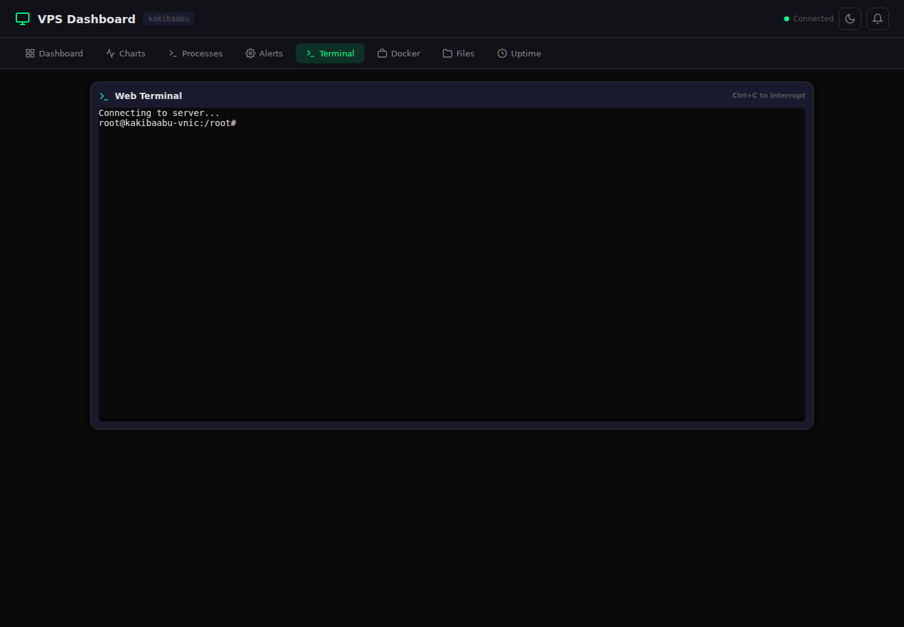

### Uptime
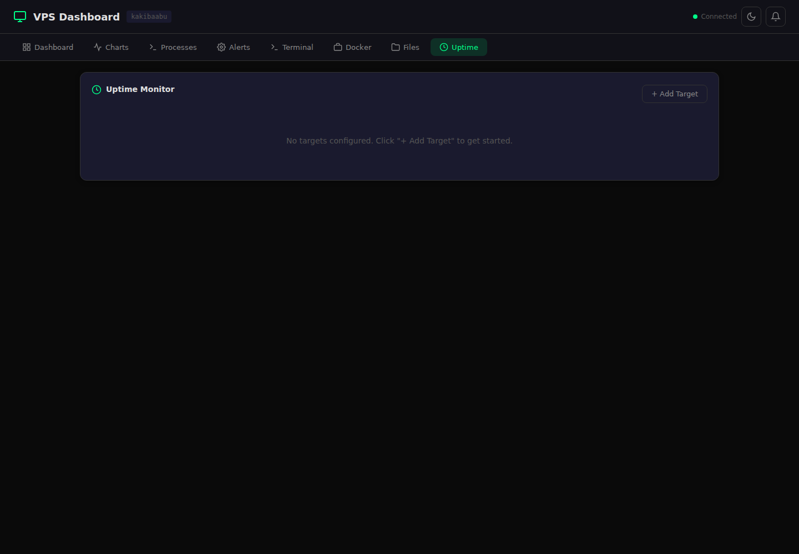

### Tools — network tools, SSL, cron, backups
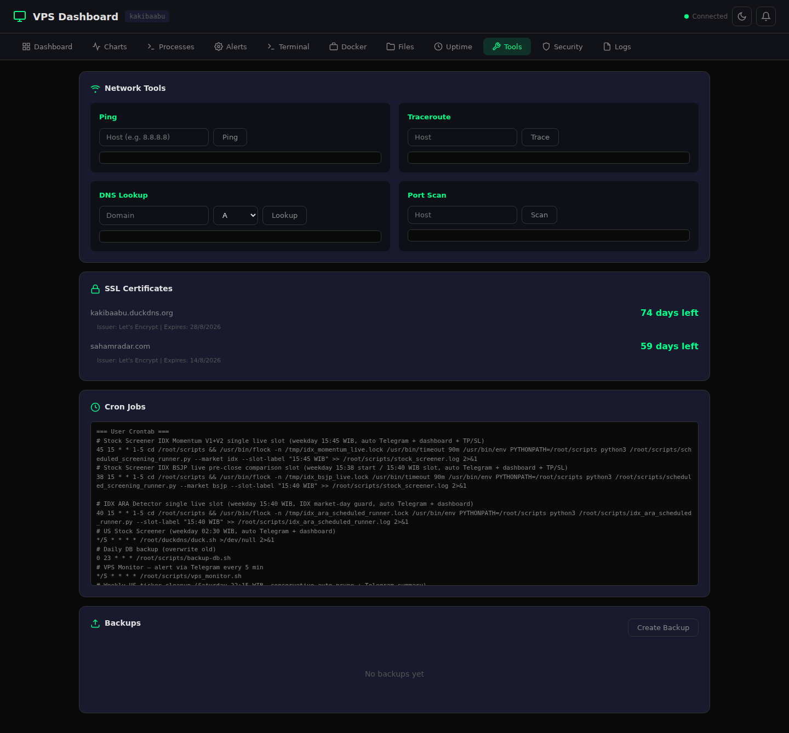

### Security — health, fail2ban, audit, 2FA, notifications
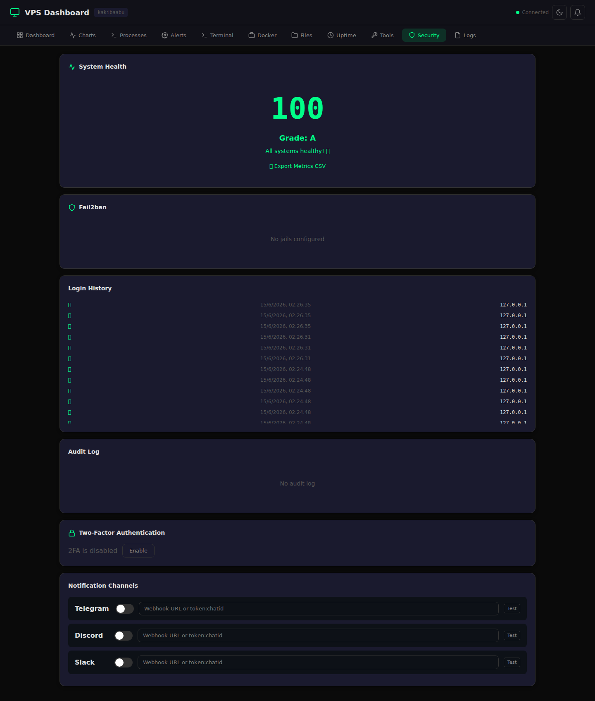

### Logs — system log viewer
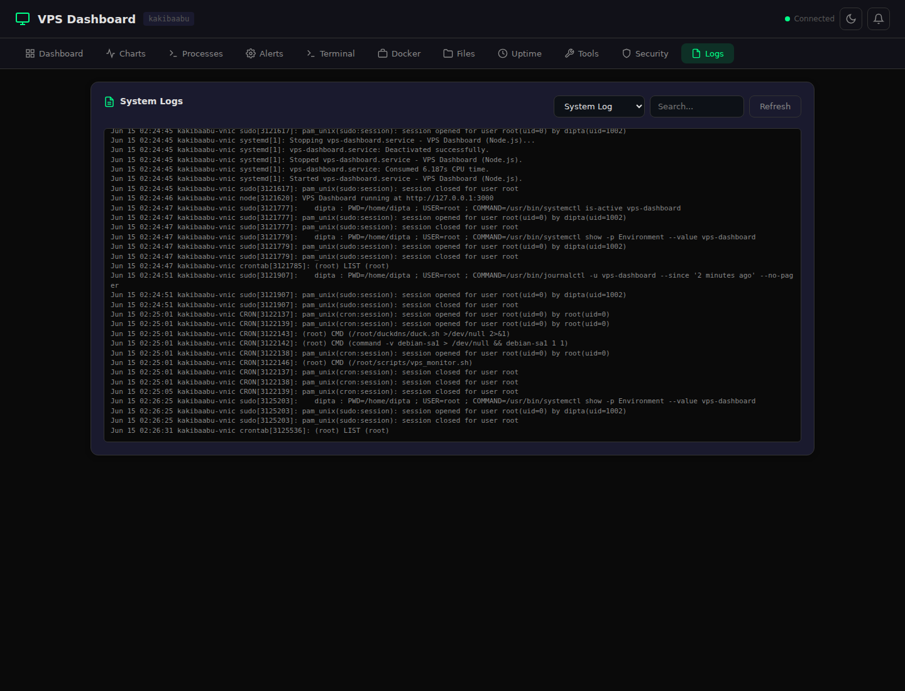

### Light theme
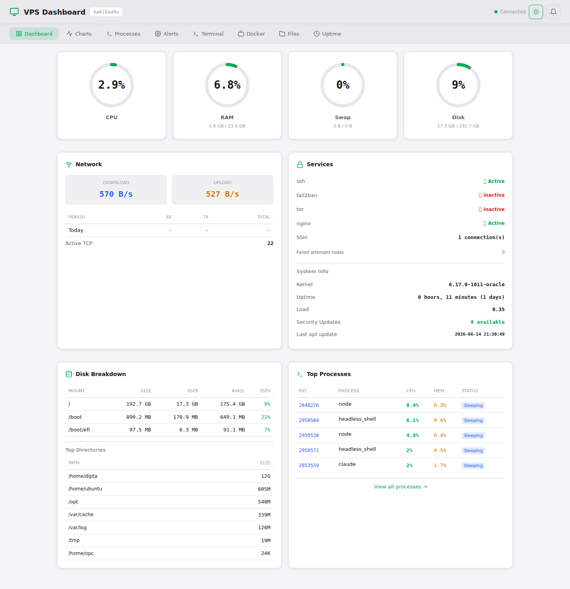

## Quick Start

```bash
# Clone or copy files
cd vps-dashboard

# Install dependencies
npm install

# Start
node server.js
```

Dashboard available at `http://localhost:3000`.

> **Fail-closed credentials:** the server refuses to start unless
> `DASHBOARD_USER` and `DASHBOARD_PASS` are set and the password is at least
> 32 characters. Generate one with `openssl rand -hex 32`.

```bash
DASHBOARD_USER=admin DASHBOARD_PASS="*** rand -hex 32)" node server.js
```

## Deploy to VPS

```bash
# One-command deploy (live-safe)
chmod +x deploy.sh
./deploy.sh
```

The script is **live-safe**: it builds the new release in a staging
directory while the current service keeps serving, and only touches the
live tree via atomic directory renames after all checks pass. It will:

1. Install Node.js (if missing)
2. Install nginx (if missing)
3. Back up the current systemd unit + drop-ins to `/root/backups/` (if present)
4. Stage the release in `/opt/vps-dashboard.new` — the live tree at
   `/opt/vps-dashboard` is never modified while the service runs (the
   checkout's `node_modules` is never carried in)
5. Install npm dependencies in the staging dir, with the Node interpreter
   pinned from the existing unit's `ExecStart` first (then system paths),
   so native modules are always built for the ABI the service runs
6. Real-load probe of the native modules (`better-sqlite3` DB open +
   `node-pty` spawn — a bare `require()` would false-negative on
   ABI-mismatched binaries); automatic rebuild under the pinned
   interpreter on mismatch
7. Prepare credentials: REUSE the existing `/etc/vps-dashboard.env` on
   redeploy (no rotation side effect); generate a fresh random password
   only on first install (root-only, mode 600) — never printed, never
   embedded in the unit. Stale `DASHBOARD_USER`/`DASHBOARD_PASS` lines
   are sanitized from existing drop-ins
8. Atomic swap (`APP_DIR` → `.prev`, staged → `APP_DIR`), one service
   restart, then a **health gate**: `/healthz` must return 200 and the
   env-file credential must authenticate. On failure the script
   automatically restores `.prev`, restarts, and exits non-zero
9. Configure nginx reverse proxy — skipped entirely if an enabled site
   already serves the domain; SSL is detected as root so root-only
   `/etc/letsencrypt` permissions don't break detection

The previous release stays at `/opt/vps-dashboard.prev` as the rollback
target. Typical downtime is the stop/start window only (a few seconds).

## Configuration

`DASHBOARD_USER`/`DASHBOARD_PASS` live in `/etc/vps-dashboard.env`
(root-only, mode 600), loaded via `EnvironmentFile=` — never put them in
`Environment=` lines or drop-ins, which override the file and leak via
`systemctl show`. `DASHBOARD_USER`/`DASHBOARD_PASS` are mandatory:
the service fails closed without them, and passwords under 32 characters are
rejected at startup:

| Variable | Default | Description |
|---|---|---|
| `PORT` | 3000 | Server port |
| `HOST` | 127.0.0.1 | Bind address |
| `DASHBOARD_USER` | admin | Login username |
| `DASHBOARD_PASS` | (generated) | Login password |
| `DB_PATH` | /var/lib/vps-dashboard/dashboard.db | SQLite database path |
| `BACKUP_DIR` | `<DB_PATH dir>/backups` | Backup storage dir (created lazily on first backup) |
| `TELEGRAM_TOKEN` | (empty) | Telegram Bot API token |
| `TELEGRAM_CHAT_ID` | (empty) | Telegram chat ID for alerts |
| `NET_IFACE` | enp0s6 | Network interface to monitor |

## Telegram Alerts Setup

1. Message [@BotFather](https://t.me/botfather) → `/newbot`
2. Copy the bot token
3. Message your bot, then visit `https://api.telegram.org/bot<TOKEN>/getUpdates` to find your chat ID
4. Edit the systemd service:
   ```
   Environment=TELEGRAM_TOKEN=your-token
   Environment=TELEGRAM_CHAT_ID=your-chat-id
   ```
5. `sudo systemctl daemon-reload && sudo systemctl restart vps-dashboard`

## API Endpoints

| Method | Path | Auth | Description |
|---|---|---|---|
| GET | `/healthz` | No | Liveness probe (no data) |
| GET | `/api/history?range=1h` | Yes | Historical metrics |
| GET | `/api/processes` | Yes | Top processes |
| POST | `/api/processes/:pid/kill` | Yes | Kill process (SIGTERM) |
| POST | `/api/processes/:pid/kill-force` | Yes | Force kill (SIGKILL) |
| POST | `/api/services/:name/restart` | Yes | Restart service |
| GET | `/api/docker/containers` | Yes | Docker containers |
| GET | `/api/docker/stats` | Yes | Docker stats |
| GET | `/api/docker/logs/:name` | Yes | Container logs |
| POST | `/api/docker/:name/:action` | Yes | Docker action |
| GET | `/api/files?path=` | Yes | List directory |
| GET | `/api/files/read?path=` | Yes | Read file |
| POST | `/api/files/write` | Yes | Write file |
| POST | `/api/files/delete` | Yes | Delete file |
| POST | `/api/files/upload` | Yes | Upload files |
| GET | `/api/uptime/targets` | Yes | Uptime targets |
| POST | `/api/uptime/targets` | Yes | Add target |
| GET | `/api/uptime/checks/:id` | Yes | Uptime history |
| GET | `/api/alerts/config` | Yes | Alert config |
| PUT | `/api/alerts/config/:type` | Yes | Update alert |
| GET | `/api/alerts` | Yes | Alert history |

## Security

- **Fail-closed credentials** — no default password; short/missing credentials abort startup (`config.js`)
- **Credential containment** — the secret lives only in `/etc/vps-dashboard.env` (umask 077, mode 600, root-only), loaded via systemd `EnvironmentFile=`; never printed by the deploy, never embedded in `Environment=` lines or drop-ins (deploy.sh sanitizes stale ones and aborts if a leak is detected). Redeploys reuse the existing secret — rotation is an explicit operation
- **Basic Auth everywhere** — static shell, REST API, and Socket.IO namespace connect all require valid credentials; browsers receive the 401 challenge on page load, so cached credentials ride along on same-origin socket.io polling requests
- **CSRF protection** — state-changing endpoints require a same-origin `Origin` header; cross-origin POSTs are rejected with 403
- **SSRF boundary** — the SSL checker resolves the target and refuses private/local addresses before connecting
- **Backup hardening** — backup creation uses `execFile` + tar with no shell interpolation
- **Polling-only sockets** — clients are pinned to `transports: ['polling']` because WebSocket handshakes cannot carry Basic Auth headers across browsers (notably iOS Safari)
- **Input hardening** — service/container/file names strictly validated, no shell interpolation in Docker/network-tool/backup commands, file manager confined to `FM_ROOT` with symlink-escape protection
- **Rate limiting** — per-endpoint limiters on auth, sensitive operations, file writes, and config changes
- **Live-safe deployment** — staging build, native-module real-load probe, atomic swap, health/auth gate with automatic rollback (see Deploy above)
- **Tests** — `npm test` runs the Node security suite; CI (`tests.yml`) runs it on every push/PR

## Tech Stack

- **Backend:** Node.js + Express + Socket.IO
- **Database:** SQLite (better-sqlite3)
- **Frontend:** Vanilla JS + Chart.js + xterm.js
- **Terminal:** node-pty + xterm.js
- **Monitoring:** /proc filesystem + systemctl + docker CLI
- **Deployment:** systemd + nginx + Let's Encrypt

## License

MIT
